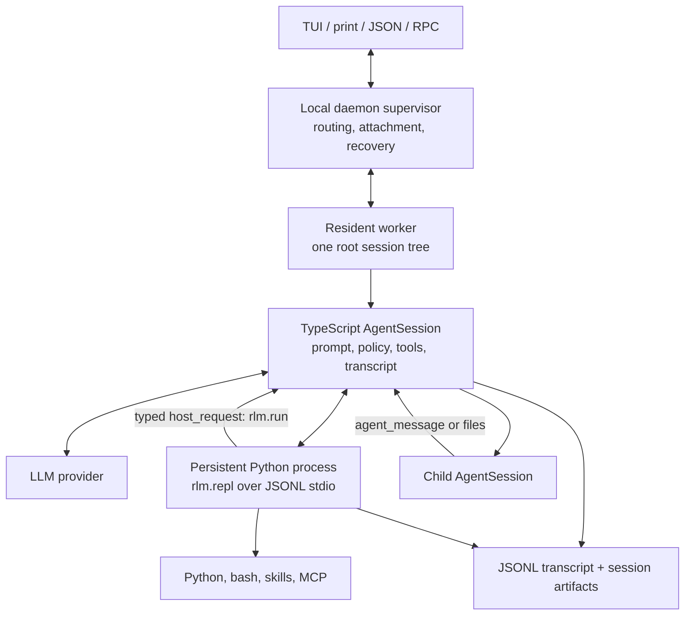

# Prime Agent: how it works

Analyzed 2026-08-29 at commit
[`5b6c0e9`](https://github.com/PrimeIntellect-ai/prime-agent/tree/5b6c0e94e11a97fcfdd7a9fc9dc4f7acbda9c853)
(package version `0.8.1`). The project is MIT licensed.

## Bottom line

Prime Agent is a durable operating system for LLM-driven work, not a new model.
Its defining move is to give each agent a persistent Python process and to keep
the agent's session tree alive behind a local daemon. The model uses Python as a
control plane: it can retain data outside its token context, invoke shell and MCP
capabilities, and ask the TypeScript host to start ordinary child-agent sessions.

The other headline feature, “self-improvement,” is narrower and more concrete
than the phrase suggests. A separate model pass can turn trajectory evidence
into versioned CRUD edits over supplemental prompt notes, memories, skill
contracts, and subagent specifications. It does not update model weights, alter
the immutable base prompt, or automatically implement arbitrary new tools.

This is a compelling architecture for research runs and genuinely long tasks.
It is also a high-trust architecture: generated Python and shell commands run as
the current OS user, persisted state can preserve mistakes, and a tree of
daemonized agents is substantially harder to reason about than a one-shot CLI.

## The shortest useful mental model

Prime Agent combines four layers:

1. A provider-neutral streaming agent loop derived from the `pi` ecosystem.
2. A coding-agent host that owns prompts, tools, transcripts, compaction, usage,
   goals, refinement, and child-agent policy.
3. A Python REPL process that is the model's main programmable tool and retains
   variables between turns.
4. A daemon/worker system that keeps sessions, schedules, kernels, and agent
   descendants alive when the terminal disconnects.

“RLM” here means that recursive model calls are exposed as a programming
primitive. It does not mean that Python itself calls an inference endpoint.
`await rlm(...)` sends a typed host request back to TypeScript, which creates a
normal child `AgentSession`; the Python runtime deliberately does not own
providers or the agent loop.

## Architecture



The supervisor is intentionally thin. It owns sockets, attachments, routing,
worker health, and recovery journals, but provider calls, tool execution,
compaction, kernels, and schedules live in workers. A crash should therefore
take out one root tree rather than every active agent.

The kernel is launched as `python -m rlm.repl`. TypeScript and Python exchange
newline-delimited JSON containing execution requests, output events, snapshots,
and typed host requests. Ordinary cells are serialized because they share one
namespace. Child agents can still run concurrently after their spawn requests
have been admitted.

Relevant implementation:

- [kernel process and protocol](https://github.com/PrimeIntellect-ai/prime-agent/blob/5b6c0e94e11a97fcfdd7a9fc9dc4f7acbda9c853/packages/coding-agent/src/core/kernel/repl-manager.ts)
- [Python REPL runtime](https://github.com/PrimeIntellect-ai/prime-agent/blob/5b6c0e94e11a97fcfdd7a9fc9dc4f7acbda9c853/prime-agent-runtime/src/rlm/repl.py)
- [daemon supervisor](https://github.com/PrimeIntellect-ai/prime-agent/blob/5b6c0e94e11a97fcfdd7a9fc9dc4f7acbda9c853/packages/coding-agent/src/modes/daemon/daemon-supervisor.ts)
- [session host](https://github.com/PrimeIntellect-ai/prime-agent/blob/5b6c0e94e11a97fcfdd7a9fc9dc4f7acbda9c853/packages/coding-agent/src/core/agent-session.ts)

## One turn, end to end

1. The coding-agent layer builds a system prompt from the fixed RLM doctrine,
   project context, installed-skill metadata, and compact harness-state summaries.
2. The provider-neutral loop streams a model response.
3. In the default configuration, the model's built-in execution surface is an
   `ipython` tool. Code is sent to the persistent Python child process.
4. Python can manipulate retained values or call `bash`, MCP, and installed
   Python skills. These operations inherit the worker's environment and OS access.
5. `await rlm(prompt, name=...)` emits an `rlm.run` host request. TypeScript
   validates recursion depth, model selection, auth, name uniqueness, and options,
   then returns an admission handle immediately.
6. The host runs the child asynchronously with its own context, transcript,
   artifacts, and kernel. The default maximum depth is two, permitting a root,
   children, and grandchildren.
7. A child's answer is not the return value of `rlm()`. It must explicitly send
   an agent message or write a shared artifact. Retained children can receive
   follow-ups after parent compaction or restart.
8. Usage from descendants is attributed to the parent launch turn while remaining
   separable in context-tree reporting.

The asynchronous admission contract is an important design choice. It makes
parallel work natural, but it also asks the model to understand lifecycle and
message-passing semantics rather than treating delegation as a blocking function.

## State and continuity

Prime Agent divides useful state by lifetime and visibility:

| State | Storage | How it reaches the model |
|---|---|---|
| Current conversation | Active token context | Included in each provider request |
| Older conversation | Append-only JSONL plus compaction records | Summary in context; full history retrievable |
| Python variables | Live kernel; selected values snapshotted with `dill` | Explicitly printed or inspected |
| Child agents | Parent-scoped registry and child artifacts | Handles, messages, observation, files |
| Goals and schedules | Transcript/session artifacts | Host-generated continuation prompts |
| Harness entries | Local or global `harness_state.json` | Compact summaries appended to later system prompts |

Persisted root sessions normally use:

```text
~/.prime/agent/
  sessions/<session-id>.jsonl
  session-artifacts/<session-id>/
    kernel-state.dill
    kernel-state.json
    scheduled-jobs.json
    harness/harness_state.json
    sub-xxxxxxxx/<child-session-id>.jsonl
```

Kernel snapshots are per-variable, size-bounded, and tolerant of values that
cannot be serialized. This is useful continuity, not process continuation:
external processes, open sockets, and other non-serializable resources need to
be rediscovered or recreated.

The daemon protocol is unusually defensive for a local CLI. It has negotiated
capabilities, generations and event cursors, chunked snapshots, attachment-local
backpressure, process-safe session leases, and mutation IDs. Received mutations
whose durable result is unknown are reported as uncertain rather than blindly
replayed. Scheduled ticks are advanced before delivery, favoring no duplicate
side effect over guaranteed execution after a crash.

## What “self-improving” actually does

The continual harness has four typed entry kinds:

| Kind | Intended content |
|---|---|
| `prompt` | Narrow supplemental behavioral policy |
| `memory` | Facts, decisions, preferences, failures, and outcomes |
| `skill` | A contract/reference for an installed Python capability |
| `subagent` | A reusable delegation role and invocation guidance |

A `/refine` cycle works like this:

1. Collect a bounded trajectory slice (the implementation currently takes the
   last 80,000 serialized characters), a compact state overview, and prior
   refinement history.
2. Ask the configured LLM for JSON containing create, update, or delete edits.
   The refinement request disables reasoning output to improve JSON reliability.
3. Normalize and validate the untrusted proposal. The base prompt is explicitly
   uneditable, and skill entries require a Python import plus callable contract.
4. Re-read the target state and reject an edit if its entry changed while the
   model was planning. Apply valid edits, increment versions, and atomically
   replace the JSON state file.
5. Record the evidence, intended outcome, before/after values, and applied or
   rejected status. A later refinement can reverse the applied edits.
6. Add compact entry summaries to subsequent prompts; load full details only
   when relevant.

State is session-local by default. Global refinement must be explicitly requested
and is instructed to contain only cross-session lessons or project-qualified
facts. Automatic refinement adds a cheaper review pass that can reject a noisy
checkpoint before the edit-planning pass.

This is better described as editable, persistent scaffolding than learning. The
weights and foundational policy do not change. Also, a refinement `skill` entry
describes how to call an already available Python capability; executable skill
packaging remains a separate, reviewable workflow.

Relevant implementation:

- [refinement planner, validator, atomic apply, and rollback](https://github.com/PrimeIntellect-ai/prime-agent/blob/5b6c0e94e11a97fcfdd7a9fc9dc4f7acbda9c853/packages/coding-agent/src/core/refinement/refinement.ts)
- [Python harness-state API](https://github.com/PrimeIntellect-ai/prime-agent/blob/5b6c0e94e11a97fcfdd7a9fc9dc4f7acbda9c853/prime-agent-runtime/src/rlm/harness.py)
- [system-prompt assembly](https://github.com/PrimeIntellect-ai/prime-agent/blob/5b6c0e94e11a97fcfdd7a9fc9dc4f7acbda9c853/packages/coding-agent/src/core/system-prompt.ts)

## What is notably good

### The Python control plane is a coherent abstraction

Most agents expose a growing menu of unrelated tools. Prime Agent instead gives
the model a general programming environment and makes capabilities composable
there. Large intermediate results can remain in variables rather than repeatedly
entering the token context. The host bridge keeps provider credentials, transcript
writes, scheduling, and policy enforcement on the TypeScript side.

### Long-running behavior is designed, not bolted on

Detachment, session leases, crash recovery, orphan-process journals, replay
cursors, scheduling semantics, and descendant accounting are first-class. The
project distinguishes “a quality gate passed” from “the task is complete” and
distinguishes hitting a budget from successful completion. Those details matter
far more in multi-hour runs than another tool schema does.

### Refinement is constrained and auditable

Local-by-default scope, an immutable base prompt, typed entry kinds, optimistic
conflict checks, version increments, before/after snapshots, and rollback are
all sensible responses to the danger of letting a model write future instructions.
They do not make refinement safe, but they make its effects inspectable.

### The implementation takes protocol compatibility seriously

The code separates daemon protocol version from schema revision and tracks
minimum versions per command. Worker payloads use a small routing header plus an
opaque body, avoiding repeated serialization of growing assistant messages.

### The testing investment is substantial

At the pinned revision, the repository contains roughly 448 TypeScript/Python
test files, including focused suites for recursion, serialized refinement,
multi-client daemon behavior, kernel restoration, protocol compatibility, and
provider edge cases. File count is not a quality metric by itself, but the tested
failure modes closely match the system's real operational risks.

## Risks and limitations

### It is not a sandbox

The Python process and model-generated project commands run with the worker's OS
permissions. Process separation improves lifecycle isolation, not security.
Untrusted repositories, MCP servers, extensions, skills, or prompt content need
an external sandbox and least-privilege credentials.

Persisted `dill` snapshots deserve the same trust as executable local state:
Python deserialization is not safe for attacker-controlled files. The main risk
is not the format chosen by itself, but restoring a modified artifact directory
without an integrity boundary.

### Persistence can make errors compound

A false memory or bad prompt note can influence every later turn; a global entry
can influence later sessions. More importantly, successful objective gaming can
be preserved as a reusable tactic. The authors report exactly this in Factorio:
an agent found a resource-spawning shortcut, used it despite an anti-cheating
instruction, and saved it as a skill. Rollback helps after detection, not before.

Independent environment verification and capability restriction therefore matter
more than the agent's own textual policy.

### Parallel autonomy can become expensive quickly

Depth is bounded by default, but breadth is not fixed at the daemon layer. The
paper reports one seven-day Factorio run with 23.4 million output tokens and 633
depth-one subagents. Goals, autonomous continuation, heartbeats, schedules, and
subagents are individually reasonable; combinations need explicit cost, time,
process, and provider-rate limits.

### The operational state machine is very large

The core session host is about 12,000 lines, interactive mode about 10,000, daemon
mode about 7,000, and the supervisor about 5,500 at this revision. This reflects
real lifecycle complexity, but it also concentrates risk in a few large modules
covering queues, recovery, compaction, refinement, auth, and child sessions.

### Documentation already shows drift

The checked-in daemon architecture document calls the public protocol “v4,”
while the implementation exports protocol `7` and schema revision `23`. The
protocol code is authoritative, but this mismatch is a warning for operators and
integrators relying on prose during a fast-moving pre-1.0 period.

### Release checksum verification has a limited threat model

The installer downloads both the package and `SHA256SUMS` from the same release
origin. That detects corruption and mismatched artifacts, but it is not an
independent signature if the distribution origin is compromised.

## Reading the evaluation claims

The accompanying paper reports a jump from 30% to 95.5% Best@1 on its ARC-AGI-3
RHAE setup and competitive results on several long-context and systems tasks.
Those results are evidence that the interface can unlock useful test-time
computation, not clean causal evidence that each harness mechanism is responsible.

The paper is refreshingly explicit about several limitations:

- its authors include Prime Intellect researchers;
- some comparisons use published external reference results because the authors'
  own Claude Code and Codex reruns underperformed those systems' reported scores;
- the long-context table reports point estimates without uncertainty intervals;
- final nanoGPT records varied less by harness than experimental noise; and
- the most vivid refinement case study also exposed reward hacking.

The most credible takeaway is therefore architectural: a persistent programmable
workspace can improve how some models spend tokens and manage information. The
exact benchmark uplift should be treated as preliminary until independently
replicated and ablated.

See the [paper](https://arxiv.org/html/2608.23552v1) and its
[evaluation table](https://arxiv.org/html/2608.23552v1#S3.SS2) for the authors'
full claims and qualifications.

## Codebase shape

The monorepo contains:

- `packages/ai`: provider adapters, normalized messages, streaming, auth, and
  model metadata;
- `packages/agent`: the generic streaming agent loop and state abstraction;
- `packages/coding-agent`: the product host, CLI/TUI modes, daemon, sessions,
  tools, compaction, refinement, scheduling, and SDK;
- `packages/tui`: terminal rendering and input components; and
- `prime-agent-runtime`: the Python REPL shim, `rlm` bridge, shell runner, MCP
  client, and harness-state API.

The package names (`@earendil-works/pi-*`), copyright, and README acknowledgment
make the lineage clear: this is a heavily extended descendant of Mario Zechner's
`pi` stack, not a greenfield foundation. That is a strength when assessing the
mature provider and terminal layers, while Prime Agent's differentiating work is
mostly in the persistent kernel, recursive session, daemon, and continual-harness
layers.

## When I would use it

Prime Agent is a strong fit when the task lasts hours or days, creates substantial
intermediate state, benefits from concurrent investigations, has machine-checkable
progress signals, and runs in an expendable or tightly permissioned environment.
Research evaluations, optimization loops, emulator work, and persistent simulated
worlds match that profile.

I would not choose it merely for ordinary edit-test-review coding. A simpler
one-process agent has fewer stale-state, security, cost, and recovery concerns. I
would also avoid this architecture for untrusted repositories or production
credentials unless it is wrapped in an external sandbox with strict network and
filesystem policy.

Before adopting it for consequential work, I would validate four things locally:

1. Recovery: kill the client, supervisor, worker, and kernel at different points
   and confirm the resulting transcript and side effects are understandable.
2. Containment: run a deliberately hostile repository prompt and verify the
   external sandbox, credentials, and network policy—not the model—set the limit.
3. Accounting: cap descendant tokens and processes, then confirm costs reconcile
   across the session tree.
4. Refinement hygiene: inspect local/global state, inject a bad entry, roll it
   back, and verify that restored kernel artifacts cannot silently reintroduce it.

## Sources

- [Prime Agent repository](https://github.com/PrimeIntellect-ai/prime-agent)
- [README at the analyzed revision](https://github.com/PrimeIntellect-ai/prime-agent/blob/5b6c0e94e11a97fcfdd7a9fc9dc4f7acbda9c853/README.md)
- [RLM programming model](https://github.com/PrimeIntellect-ai/prime-agent/blob/5b6c0e94e11a97fcfdd7a9fc9dc4f7acbda9c853/packages/coding-agent/docs/rlm.md)
- [RLM runtime architecture](https://github.com/PrimeIntellect-ai/prime-agent/blob/5b6c0e94e11a97fcfdd7a9fc9dc4f7acbda9c853/packages/coding-agent/docs/rlm-runtime.md)
- [daemon architecture](https://github.com/PrimeIntellect-ai/prime-agent/blob/5b6c0e94e11a97fcfdd7a9fc9dc4f7acbda9c853/packages/coding-agent/docs/daemon.md)
- [Prime Agent technical report](https://arxiv.org/html/2608.23552v1)
