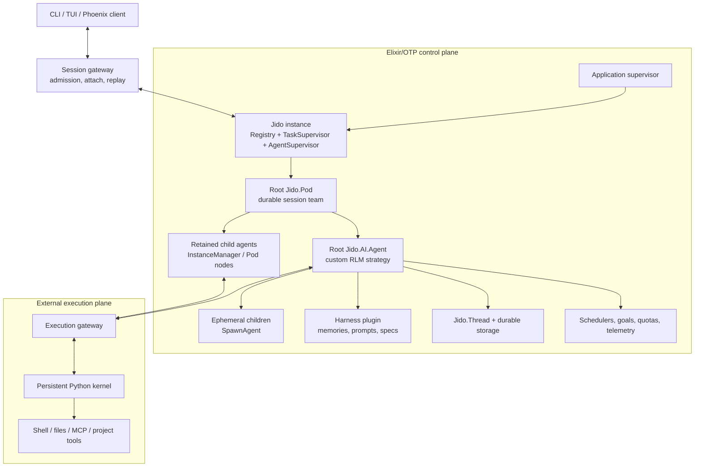

# What if Prime Agent were built with Elixir, Jido 2, and the BEAM?

Analyzed 2026-08-29 against:

- Prime Agent [`5b6c0e9`](https://github.com/PrimeIntellect-ai/prime-agent/tree/5b6c0e94e11a97fcfdd7a9fc9dc4f7acbda9c853), version `0.8.1`;
- Jido [`adf3e05`](https://github.com/agentjido/jido/tree/adf3e058e842c1c6dd9dae3bceff842dbeb3070d), version `2.3.3`; and
- Jido AI [`9438914`](https://github.com/agentjido/jido_ai/tree/9438914df5ac6a9d882762eb510564783d8b9a07), version `2.3.0`.

This is a counterfactual architecture review, not a benchmark or a claim that
the existing systems are API-compatible.

## Bottom line

A Jido 2/BEAM implementation would probably be a better **multi-agent control
plane** and a worse **unified coding-agent runtime** unless it kept Python and
shell execution outside the BEAM.

OTP already supplies much of the machinery Prime Agent has implemented itself:
cheap isolated processes, supervisors, registries, monitors, asynchronous
messages, task supervisors, and release lifecycle. Jido adds immutable agent
state, typed effect directives, logical parent-child relationships, durable
agent and team abstractions, signals, scheduling, and telemetry. Those primitives
fit Prime Agent's daemon, worker, messaging, and session-tree problems unusually
well.

But Prime Agent's most distinctive feature is not its daemon. It is the durable,
model-programmable Python environment. Moving orchestration to Elixir does not
make Python state, shell processes, filesystem mutation, or arbitrary user code
BEAM-native. Removing the REPL would discard the RLM design; retaining it means
the system still needs supervised OS processes and a cross-runtime protocol.

The strongest design is therefore hybrid:

- use Jido and OTP for lifecycle, routing, policy, persistence, telemetry, and
  multi-agent coordination; and
- keep each workspace's Python/shell execution in a separately supervised,
  externally sandboxed OS service reached through an Erlang port or local RPC.

A full rewrite is most justified for a hosted, multi-tenant agent service with
many concurrent sessions. For a local, single-user coding CLI, Prime Agent's
existing process model is at least as defensible and has stronger per-session
OS crash containment.

## The architectural substitution

Prime Agent currently builds a small distributed system on one machine: a daemon
supervises OS workers, each worker owns a session tree, and each session owns a
Python process. A Jido design would make the coordination layer an OTP
application and represent agents as supervised BEAM processes.



The execution gateway is not optional if the redesign intends to remain Prime
Agent rather than become a conventional ReAct system. Erlang ports are a natural
lifecycle bridge: a port owner communicates with an external OS process and can
observe its exit. The external process should still run inside a container,
restricted user, or stronger sandbox; a port is process integration, not a
security boundary.

## Component-by-component mapping

| Prime Agent component | Jido/BEAM equivalent | Important qualification |
|---|---|---|
| Detached supervisor | OTP application supervisor plus a Jido instance | OTP replaces much custom restart plumbing, but a whole VM crash remains a larger failure domain |
| Resident root worker | A root `Jido.Pod` or partition-scoped durable agent | A pod is a durable logical team, not an OS-isolated worker |
| `AgentSession` | `Jido.AI.Agent` with a custom RLM strategy | Stock ReAct is not Prime Agent's Python-first loop |
| Child-agent registry | `SpawnAgent` for ephemeral children; `InstanceManager`/Pod nodes for durable children | Jido deliberately splits live child and durable lifecycle into different abstractions |
| Direct agent messages | `Jido.Signal` plus `Emit` directives | Signals need an application-level durable inbox if delivery must survive restarts |
| `ReplKernelManager` | A dedicated port-owner GenServer or RPC client | Python still runs outside the VM |
| JSONL transcript | `Jido.Thread` append-only entries | Large tool artifacts should be stored out of band and referenced by ID |
| Session snapshot/artifacts | `Jido.Persist` checkpoint plus a storage adapter | Live PIDs, ports, streams, and Python objects must be excluded and rebuilt |
| Continual harness | A versioned Jido plugin state slice plus refinement actions | Applying model-written state still needs validation, scope, CAS, and rollback |
| Goals/autonomous mode | Plugins or FSM strategy emitting continuation directives | Completion and budget state become explicit, testable transitions |
| Heartbeats/schedules | Jido schedule/cron directives, or Oban for stronger durability | Jido's built-in timers can miss ticks and do not provide exactly-once execution |
| Daemon client protocol | Phoenix Channels, a Unix-socket gateway, or a small custom transport | Jido itself does not replace attachment snapshots, cursors, and backpressure |
| Usage accounting | Jido telemetry and trace context aggregated by session tree | Parent/descendant billing reconciliation remains application logic |

## Where the design would improve

### 1. Supervision would become a runtime primitive

Prime Agent's daemon has careful worker adoption, retry delays, orphan-process
journals, recovery generations, and shutdown coordination. OTP supervisors,
links, and monitors provide a standard vocabulary for much of that lifecycle.
A crashed agent process can be restarted without custom process polling, while a
`DynamicSupervisor` naturally handles a changing population of sessions.

Jido 2 creates one instance-scoped supervision tree containing a registry, task
supervisor, runtime store, and dynamic agent supervisor. This is a cleaner fit
than a single global agent registry and gives tests or tenants isolated instances.
See [Jido's supervisor implementation](https://github.com/agentjido/jido/blob/adf3e058e842c1c6dd9dae3bceff842dbeb3070d/lib/jido.ex)
and the [OTP supervision principles](https://www.erlang.org/doc/system/design_principles.html).

This does not eliminate recovery design. It changes the default from “detect a
dead process and reconstruct it” to “declare restart policy and reconstruct only
the durable domain state.” That usually produces less lifecycle code and clearer
failure ownership.

### 2. Agent state and side effects would be easier to reason about

Jido's core transition is:

```text
signal -> action -> cmd(agent, action) -> {new_agent, directives}
```

The agent state is immutable; directives describe runtime-owned effects. This
would split Prime Agent's roughly 12,000-line `AgentSession` responsibility set
into explicit state transitions and effect handlers. Goal changes, child spawn,
message delivery, scheduling, refinement apply, and terminal-state decisions
could be unit-tested without starting providers or subprocesses.

Typed directives also create a natural authorization point. A policy layer can
allow a read-only file action, deny a shell action, cap child creation, or require
approval before the effect executor runs. Jido AI already has request-scoped tool
selection and effect-policy machinery, though Prime Agent would need a stricter
workspace capability model on top.

The relevant Jido contracts are documented in
[`Jido.Agent`](https://jido.hexdocs.pm/Jido.Agent.html),
[`Jido.AgentServer`](https://jido.hexdocs.pm/Jido.AgentServer.html), and
[`Jido.Agent.Directive`](https://jido.hexdocs.pm/Jido.Agent.Directive.html).

### 3. High-concurrency coordination would be cheaper

BEAM processes are far lighter than OS worker processes and have isolated heaps.
Thousands of idle agents, client attachments, timers, and small coordination
workers are a workload the VM is designed to host. Per-process garbage collection
also reduces global pauses caused by ordinary agent state.

This advantage applies to orchestration, not the heavy execution substrate. Each
live Python kernel is still an OS process with substantial memory. A BEAM rewrite
can cheaply host more *agent coordinators* than Prime Agent's worker model, but it
cannot cheaply host an unlimited number of persistent Python interpreters.

BEAM messages also are not free: most terms are copied between process heaps,
with reference-counted binaries as an important exception. Large transcripts,
tool results, and snapshots should therefore travel as binary or artifact handles,
not repeatedly copied nested maps. See the official
[process efficiency guide](https://www.erlang.org/docs/25/efficiency_guide/processes).

### 4. Durable teams have a close Jido abstraction

Jido's current guidance distinguishes:

- `SpawnAgent` for a live child in the current workflow;
- `InstanceManager` for one keyed agent that can hibernate and thaw; and
- `Jido.Pod` for a named team with persisted topology and explicit reconciliation.

A Prime root and its retained children map well to a Pod. The pod can persist its
topology, re-acquire children after thaw, and mutate the durable topology as the
model creates or deletes reusable collaborators. Ephemeral one-turn research
children remain `SpawnAgent` directives.

This is more explicit than Prime Agent's single RLM child abstraction, but it is
also more complex: the caller must decide whether a child is ephemeral, durable,
or part of a durable topology. Jido's own
[runtime-pattern guide](https://jido.hexdocs.pm/runtime-patterns.html) emphasizes
that these are separate lifecycle choices.

### 5. Hosted operation and observability would improve

Phoenix Channels or LiveView could expose attach/detach, streaming output, agent
trees, and human intervention without inventing a separate UI process model.
Telemetry spans can carry session, request, causation, child, tool, provider, and
tenant identifiers across the tree. Jido already emits agent, strategy, and pod
events with trace and causation metadata.

Partitions and separate Jido instances also give a useful hosted-service choice:
logical namespace separation within one VM, or distinct supervision trees and
storage configurations. Neither is a security sandbox, but both make ownership
and observability more systematic.

### 6. Persistence would have a standard domain model

`Jido.Thread` is an append-only canonical event history; `Jido.Persist` writes
checkpoints for fast thaw and verifies the referenced thread revision. Storage
adapters support compare-and-append via an expected revision. This is a strong
base for transcripts, compaction records, refinement history, and optimistic
concurrency.

For production use, Prime Agent's state would need an Ecto/Postgres or similarly
transactional adapter rather than relying only on local term files. Kernel
snapshots and large artifacts should live in object/file storage with hashes and
references in the thread. The core persistence model is described in Jido's
[storage guide](https://hexdocs.pm/jido/storage.html) and
[`Jido.Persist` source](https://github.com/agentjido/jido/blob/adf3e058e842c1c6dd9dae3bceff842dbeb3070d/lib/jido/persist.ex).

## Where it would become less effective

### 1. The Python REPL creates a fundamental impedance mismatch

Prime Agent lets the model write arbitrary Python, preserve variables, import
libraries, transform large data, and compose tools dynamically. Jido's preferred
unit is a declared `Action` with a validated schema. The former maximizes model
expressivity; the latter maximizes predictability and policy control.

There are only three real choices:

1. Replace Python with predeclared Elixir actions. This gives the cleanest Jido
   system but loses Prime Agent's RLM programming model and much of Python's data,
   ML, and repository-tool ecosystem.
2. Execute arbitrary Elixir generated by the model. This is a poor substitute:
   it expands the trusted code surface inside the VM and risks atom exhaustion,
   scheduler interference, and node-wide failure.
3. Keep Python as an external process. This preserves capability, but the system
   still needs framing, cancellation, output limits, snapshots, restoration, and
   orphan process cleanup across the BEAM/OS boundary.

The third option is the only faithful one. It means the rewrite improves the
control plane rather than eliminating Prime Agent's runtime complexity.

### 2. Failure isolation could regress at the top level

Ordinary BEAM process failures are well isolated, but all agents in a node still
share one VM and OS identity. A node crash, memory exhaustion, unsafe NIF, or
misconfigured native dependency can take down every session on that node. Prime
Agent's resident OS worker model intentionally limits a worker crash to one root
tree.

A robust hosted design would therefore run several BEAM nodes or containers and
place a bounded number of root pods on each. Python and shell execution should
be in separate sandbox workers. “One BEAM node for every agent” would throw away
the density advantage; “one BEAM node for everything” would create too large a
blast radius.

The BEAM itself does not prevent resource exhaustion, and unsafe native code can
still affect the whole runtime. Erlang's
[secure-coding guide](https://www.erlang.org/doc/system/secure_coding.html) is
explicit about both limits.

### 3. Jido's live and durable child models do not exactly match Prime's

`SpawnAgent` tracks a logical child and monitors it, but it does not add
InstanceManager persistence or hibernate/thaw. Durable children must be managed
separately or represented as Pod nodes and reconciled. Jido's logical hierarchy
is also not OTP supervisory ancestry: parent and child agents are peers under the
dynamic supervisor.

Prime Agent exposes one child handle that can begin asynchronously, survive
compaction, become daemon-addressable, receive follow-ups, and contribute usage
to its parent's launch turn. Reproducing that experience over Jido requires a
facade that chooses the underlying lifecycle, maintains stable IDs across PID
changes, restores parent bindings, and persists usage attribution.

Without that facade, the Jido version would expose framework lifecycle concepts
to the model and make delegation harder rather than easier.

### 4. Mailboxes are not durable queues or backpressure

BEAM messaging is asynchronous and preserves ordering only for signals from the
same sender to the same receiver. Messages can be lost when a distributed channel
goes down. A GenServer mailbox can grow without a built-in capacity limit; Jido's
directive queue has a configured limit, but that does not bound every ingress
mailbox.

Prime Agent's attachment-local backpressure, replay cursors, snapshots, mutation
IDs, and persistent coordination semantics would still need application code.
Agent-to-agent messages that must survive restart should first be appended to a
durable inbox/outbox and then signaled to the receiver. The signal is a wake-up;
the journal is the source of truth.

See Erlang's exact [signal and ordering guarantees](https://www.erlang.org/doc/system/ref_man_processes.html).

### 5. Built-in scheduling is not stronger than Prime Agent's scheduler

Jido's process-local timers are convenient and dynamic cron specifications can
be restored for storage-managed agents, but missed ticks are not replayed and
exactly-once behavior is explicitly out of scope. Prime Agent already uses
claim-before-delivery and coalescing semantics to avoid replaying uncertain work.

For consequential jobs, an Elixir redesign should use a database-backed job
system such as Oban or implement Prime's durable claim protocol over the chosen
storage adapter. The built-in Jido scheduler is appropriate for heartbeats whose
occasional loss is acceptable. Its guarantees are documented in the
[Jido scheduling guide](https://hexdocs.pm/jido/scheduling.html).

### 6. “Distributed BEAM” is not a free upgrade

OTP makes remote PIDs, messages, links, and monitors convenient, but Jido's
current Pod runtime explicitly scopes itself to a single node rather than a
distributed pod graph. Cross-node placement, split-brain avoidance, durable
registry ownership, artifact locality, Python-worker placement, and session
leases remain design problems.

Default Erlang distribution also assumes a trusted network and is not safe to
expose without TLS and careful node configuration. A hosted system should use
TLS distribution or an application protocol and should treat every connected
node as fully trusted. See the official
[distributed Erlang security warning](https://www.erlang.org/docs/27/system/distributed.html).

### 7. A rewrite would surrender mature product behavior

Prime Agent already has broad provider normalization, OAuth flows, a terminal UI,
model-specific reasoning handling, compaction, protocol compatibility tests,
installer/update mechanics, and hundreds of test files. Jido AI supplies ReqLLM,
ReAct, tool calling, streaming, context projection, checkpoints, skills, and
several reasoning strategies, but it is not a drop-in replacement for those
product details.

The hardest migration work would not be spawning agents. It would be reproducing
the edge cases around provider streams, tool-call normalization, interactive
terminal behavior, session branching, client reconnection, accounting, and
kernel restoration without regressions.

## A better Jido design, in detail

If building this system fresh, I would use the following boundaries.

### Root session as a durable Pod

Each workspace/session is a partition-scoped `Jido.Pod` acquired through an
`InstanceManager`. Its persisted topology contains the root agent and any child
that must remain independently addressable after hibernation. Short-lived child
work uses `SpawnAgent` and is promoted into the Pod only when retention is
explicitly requested.

The Pod manager owns stable logical IDs and topology, not provider work. On thaw,
it reconciles desired nodes with live processes and restores logical attachments.

### Custom RLM strategy, not stock ReAct alone

`Jido.AI.Agent` defaults to a bounded ReAct loop with declared tools. Prime Agent
needs a strategy whose primary tool is a kernel execution action and whose state
machine understands:

- prompt admission, queue, steer, and follow-up modes;
- Python cell start/output/completion;
- asynchronous child admission and later agent messages;
- compaction boundaries;
- goal and autonomous continuation policy; and
- terminal success distinct from budget exhaustion.

Jido AI's Task-based ReAct runner, request handles, event stream, context
projection, and signed checkpoint tokens are reusable pieces, but the host
strategy must preserve Prime's semantics. The current Jido AI surface is described
in [`Jido.AI.Agent`](https://jido-ai.hexdocs.pm/Jido.AI.Agent.html) and the
[current ReAct implementation](https://github.com/agentjido/jido_ai/blob/9438914df5ac6a9d882762eb510564783d8b9a07/lib/jido_ai/reasoning/react.ex).

### External execution gateway

One supervised gateway process per active session owns the connection to a
Python kernel service. It uses length-framed binary messages, correlation IDs,
deadlines, output quotas, and explicit cancellation. It never sends giant Python
objects through BEAM mailboxes; snapshots and large outputs go to content-addressed
artifact storage.

The gateway should expose capabilities rather than the worker's full environment:
workspace root, allowed environment variables, network policy, process limits,
and credential handles. Shell descendants belong to the external sandbox's
process group, so killing or replacing a kernel cannot strand project commands.

An Erlang port is suitable for a local worker and naturally ties the child
process to a port owner. A remote sandbox pool should use authenticated local RPC
or a broker instead. The official [ports documentation](https://www.erlang.org/doc/system/c_port.html)
describes the ownership and failure relationship.

### Event log before notification

All user prompts, model events, tool calls, messages, goal transitions,
refinement edits, child lifecycle changes, and accounting entries first append
to `Jido.Thread` or a dedicated transactional event store. Signals notify live
processes that new durable work exists. Checkpoints are projections used for fast
restart, never the only source of truth.

Use monotonic per-session sequence numbers and idempotency keys. Store assistant
stream deltas in bounded chunks, and produce periodic materialized snapshots for
attachment. This preserves the best parts of Prime Agent's replay protocol while
using Jido's revision-aware persistence.

### Harness as typed plugin state with transactional refinement

Represent prompt notes, memories, skill contracts, and subagent specs as a
singleton harness plugin. `/refine` launches a supervised planning task over a
snapshot revision. Its result is parsed into typed edit actions and committed in
one transaction only if the revision is unchanged. Before/after data and evidence
are appended to the event log for rollback.

Global harness state should be a separate namespace and permission from local
session state, not a boolean passed deep into an action. Executable skills remain
versioned application packages or sandbox artifacts; a model-written metadata
entry must not load arbitrary code into the BEAM.

### Explicit admission and resource budgets

Place a gateway in front of every root agent. It persists prompt admission,
assigns command IDs, and enforces limits before sending a signal. Each root Pod
has budgets for:

- active and retained child count;
- Python kernels and shell processes;
- mailbox/directive queue depth;
- provider requests and tokens;
- artifact bytes;
- wall-clock time; and
- scheduled continuations.

OTP supervisors restart failures; they do not enforce business budgets. Resource
limits must remain explicit domain policy.

## Comparative verdict

| Dimension | Likely result of a careful Jido/BEAM design |
|---|---|
| Many concurrent idle/live agents | Better |
| Ordinary process crash recovery | Better and simpler |
| Pure state-transition testing | Better |
| Typed effect policy and observability | Better |
| Hosted multi-tenant control plane | Better |
| Persistent arbitrary Python computation | No inherent improvement; still external |
| Per-root OS crash containment | Worse unless roots are spread across nodes/containers |
| Large transcript and artifact movement | Potentially worse if passed through mailboxes naively |
| Durable child semantics | More explicit, but not simpler without a facade |
| Scheduling guarantees | Roughly equivalent by default; stronger only with added durable jobs |
| Security sandboxing | Unchanged unless an external sandbox is added |
| Distributed operation | Possible, but substantially more work than “turn on distribution” |
| Near-term product completeness | Worse because a rewrite must recover mature edge cases |

## Recommendation

Do not rewrite Prime Agent wholesale merely to obtain OTP-style supervision. Its
current daemon already implements many of the right semantics, and the Python
kernel ensures that OS-process orchestration remains necessary.

Use Jido/BEAM when the product requirement changes from “a powerful local agent”
to “a continuously running service hosting many agent teams.” In that setting,
build the BEAM layer as a control plane around sandboxed execution workers. Start
with one narrow vertical slice—durable root session, one Python gateway, one
ephemeral child, event replay, and kill/recovery testing—before migrating provider
or UI surfaces.

The decisive experiment is not a toy chat agent. Run the same 24-hour workload
through both architectures and compare:

1. recovery correctness after killing the client, coordinator, Python worker,
   and whole BEAM node;
2. resident memory per idle root and per active Python kernel;
3. p95 event-stream and agent-message latency under hundreds of sessions;
4. transcript/artifact bytes copied through the control plane;
5. orphan process count after forced cancellation; and
6. reconciled token, cost, and child-usage totals after restart.

If density and operational clarity improve without weakening root isolation or
RLM expressivity, the hybrid is justified. If Python workers dominate memory and
failure behavior, the BEAM rewrite has optimized the smaller half of the system.

## Primary sources

- [Jido 2.3.3 documentation](https://jido.hexdocs.pm/)
- [Jido runtime patterns](https://jido.hexdocs.pm/runtime-patterns.html)
- [Jido AgentServer](https://jido.hexdocs.pm/Jido.AgentServer.html)
- [Jido persistence and storage](https://hexdocs.pm/jido/storage.html)
- [Jido scheduling semantics](https://hexdocs.pm/jido/scheduling.html)
- [Jido AI Agent](https://jido-ai.hexdocs.pm/Jido.AI.Agent.html)
- [Jido AI context and thread projection](https://jido-ai.hexdocs.pm/thread_context_and_message_projection.html)
- [OTP design principles](https://www.erlang.org/doc/system/design_principles.html)
- [Erlang process and signal semantics](https://www.erlang.org/doc/system/ref_man_processes.html)
- [Distributed Erlang](https://www.erlang.org/docs/27/system/distributed.html)
- [Prime Agent architecture analysis](architecture.md)
