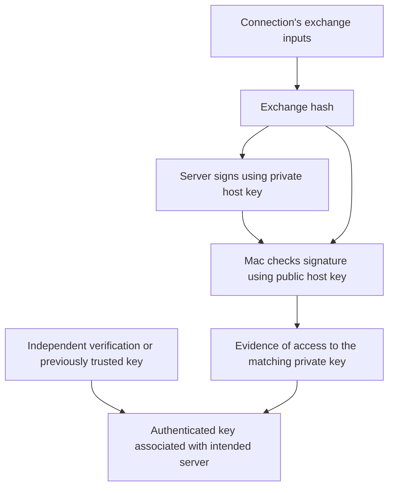

# How SSH establishes the server's identity

[Series index](README.md) · [Next: signatures](signatures.md)

SSH gives you a terminal on another computer over an encrypted connection.
For example, on your Mac:

```bash
ssh root@192.0.2.10
```

Here `ssh` starts the client, `root` selects the remote administrator account,
and `192.0.2.10` stands for the server's address. It is an example address, not a
server to connect to.

Before accepting your login, SSH must establish the connection's security.
Encryption protects traffic, but you also need to know who is at the other end.

## The two identity checks

| Check | Question | Typical evidence |
|---|---|---|
| Server authentication | Is this the server I intend to reach? | A trusted host public key and a valid signature |
| User authentication | May this person log into this account? | A password or a signature using the user's own key |

Your server's host key and your personal login key have different jobs. Using a
password to log in does not eliminate the server's host-key check. OpenSSH
performs user authentication after establishing the secure transport.
[OpenSSH manual](https://man.openbsd.org/ssh#AUTHENTICATION)

## A public key alone proves nothing

A key pair consists of a secret private key and a shareable public key. Anyone
can copy the public key. Merely presenting it cannot establish possession of the
private key.

During key exchange, the server signs an **exchange hash**: a digest calculated
from the protocol's specified exchange inputs. These bind together such things
as the version strings, negotiation messages, host key, and key-exchange values.
The client calculates the expected hash and verifies the signature using the
public host key. Fresh key-exchange inputs bind that proof to this exchange;
replaying a previous signature against a different exchange fails.
[SSH transport specification, sections 7–8](https://www.rfc-editor.org/rfc/rfc4253.html#section-7)

This is a conceptual dependency diagram, not the exact ordering of packets or
the user prompt:



## Whose key is it?

Imagine an impostor answering your connection with its own key pair. It can
produce a perfectly valid signature under its own public key. Nothing about that
mathematics tells your Mac that the key belongs to your rented server.

The client needs an association between the destination and the expected key.
For a new host, OpenSSH commonly asks you to accept an unfamiliar fingerprint.
Acceptance records the host public key in `~/.ssh/known_hosts`. Future connections
can check it against that record; a changed key triggers a warning under normal
interactive settings. The saved record contains the public key, not just its
displayed fingerprint. [OpenSSH host-key handling](https://man.openbsd.org/ssh#AUTHENTICATION)

There are two ways to establish that initial association:

- **Independent verification:** obtain the expected fingerprint through a trusted
  separate route, such as an authenticated provider console accessing the actual
  server, and compare it with the SSH prompt.
- **Trust on first use:** accept the first key without that independent check and
  use it as the baseline for future connections.

Checking the IP against your order checks that you typed the intended destination.
It does not independently authenticate the key returned over the network.
Likewise, fetching the key again through the same unverified route does not add
an independent source of trust.

## What this does and does not establish

A trusted key and valid exchange signature support the conclusion that this
exchange was authenticated by someone able to use the expected private key.
That depends on secure algorithms, correct implementation, and key custody.

It does not certify that the server's software is harmless, that its operator is
honest, or that the key exists on only one physical machine. A copied private key
can impersonate the same identity. Conversely, a legitimate reinstall may create
a different key. A change needs investigation; it does not by itself explain
what happened.

Prediction: an impostor copies only the public key. Can it complete the signature
check for a fresh exchange? No. If it instead supplies its own key pair, its
signature can pass, but its key will not match an independently verified or
previously saved key.
